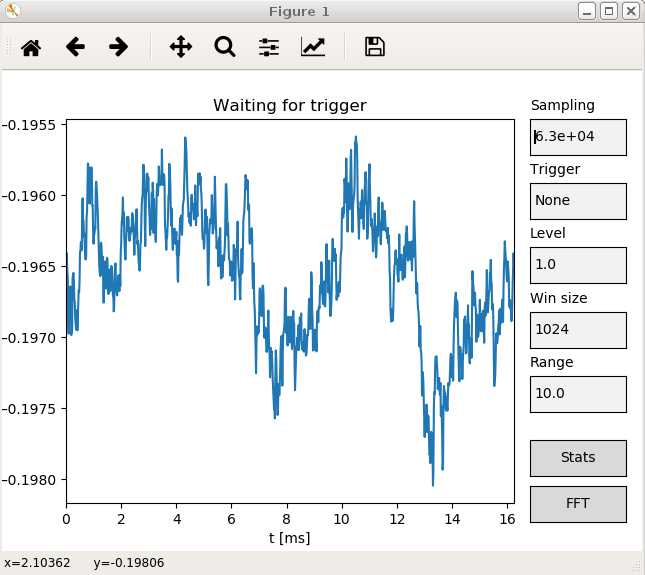

.. _oscillo:

Oscilloscope
============

The `oscillo` sub-commands implements a simple matplotlib GUI for the :mod:`pymanip.aiodaq` module, and allows use any of these channels as oscilloscope and live signal analyser. It is simply invoked with this command

.. code-block:: bash
    
    $ python -m pymanip oscillo

then the user is prompted for the channels that can be viewed (on the connected DAQmx and Scope cards).

